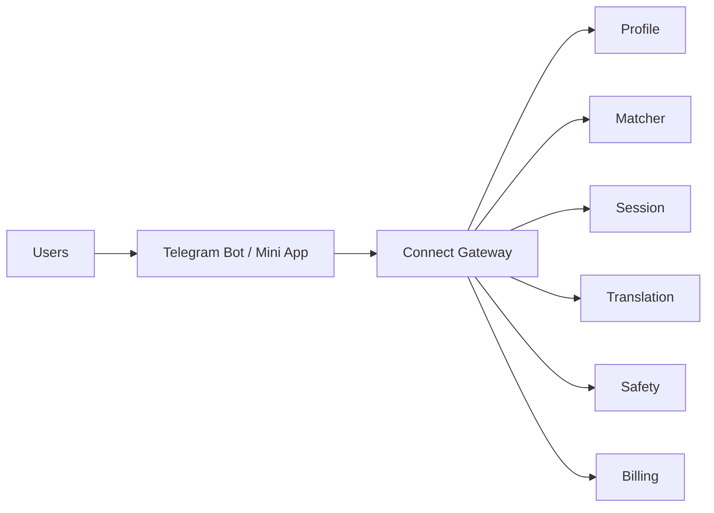

# Architecture overview (draft)

Telegram (or chosen host) handles message delivery and baseline spam controls.

Connect backend owns:
- Identity link (Telegram user id)
- Profiles (country, tastes, pause, subscription)
- Daily / theme matching
- Session lifecycle (24h)
- Translation proxy
- Report/block + triage hooks
- Billing entitlements

Details evolve after UNG-6 decision.
